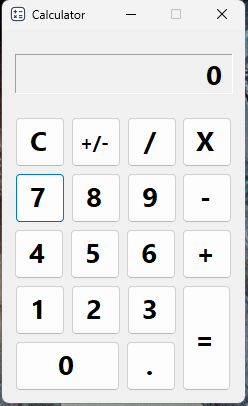

# Calculator App



## Overview

The **Calculator App** is a simple desktop application built using C# and Windows Forms. It provides basic arithmetic operations (+, -, *, /) on floating-point numbers through a user-friendly graphical interface.

## Features

- **Basic Arithmetic Operations:** Addition, Subtraction, Multiplication, Division.
- **Clear Functionality:** Reset button to clear inputs and start fresh.
- **Sign Toggle:** Change the sign of the current number.
- **Decimal Point:** Add decimal point for floating-point numbers.

## Usage

1. **Installation:**
   - Clone the repository:
     ```
     github.com/toladev0/calculatorApp.git
     ```
   - Open the solution in Visual Studio.
   - Build and run the project (`F5` or `Ctrl+F5`).

2. **How to Use:**
   - Click on the number buttons (`0-9`) to input numbers.
   - Click on the operation buttons (`+`, `-`, `*`, `/`) to choose the arithmetic operation.
   - Use `=` to compute the result.
   - Use `C` to clear the display and reset the calculator.
   - Use `±` to toggle the sign of the current number.
   - Use `.` to add a decimal point for floating-point numbers.

3. **Error Handling:**
   - Division by zero and other errors are handled gracefully, displaying "Error" when necessary.

## Implementation Details

- **Technologies Used:** C#, Windows Forms.
- **Variables:** `currentNumber`, `operation`, `firstNumber`, `secondNumber`, `result`, `isDuplicate`.
- **Methods:** `Reset`, `GetNumber`, `GetOperation`, `Calculate`, and event handlers for button clicks.
- **Error Handling:** Try-catch blocks ensure smooth operation and user feedback on errors.

## Future Improvements

- **Enhanced UI:** Improved styling and layout for a more modern look.
- **Advanced Features:** Support for more mathematical functions (e.g., square root, exponentiation).
- **Unit Testing:** Implement unit tests to ensure robust functionality.

## License

This project is licensed under the MIT License - see the [LICENSE](./LICENSE) file for details.
